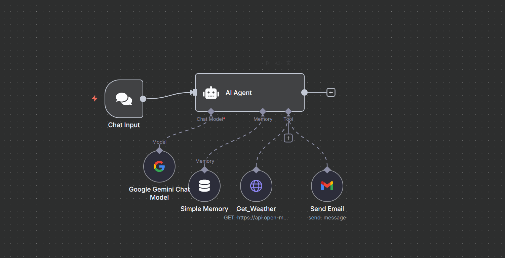

# 🌦️ Funny Weather Agent (n8n)

This is an AI-powered agent built using [n8n](https://n8n.io) that:
- Takes a location or city name as input
- Fetches the live weather using Open-Meteo API
- Uses Google Gemini to generate a **funny weather report**
- Emails the final result using Gmail

---

## 🎯 Features
- No code required — built with n8n nodes and integrations
- Uses context-aware AI via Gemini
- Sends an automated email with the generated report

---

## 🛠️ Tools Used
- **n8n** (workflow automation)
- **Google Gemini** (LLM response)
- **Open-Meteo API** (weather data)
- **Gmail Integration** (for output delivery)

---

## 📸 Screenshot

---

## 📂 Files Included
- `flow.json` — n8n export of the agent
- `/screenshots/agent-flow.png` — flow diagram

---

## 🚀 How to Run
1. Open [n8n](https://n8n.io)
2. Import the `flow.json`
3. Set up your credentials:
   - Gemini or OpenAI API
   - Gmail
4. Trigger the flow and receive your weather update via email — with jokes included 😄

---

> Built as part of my learning journey into agent-based automation.  
> More agents coming soon!

